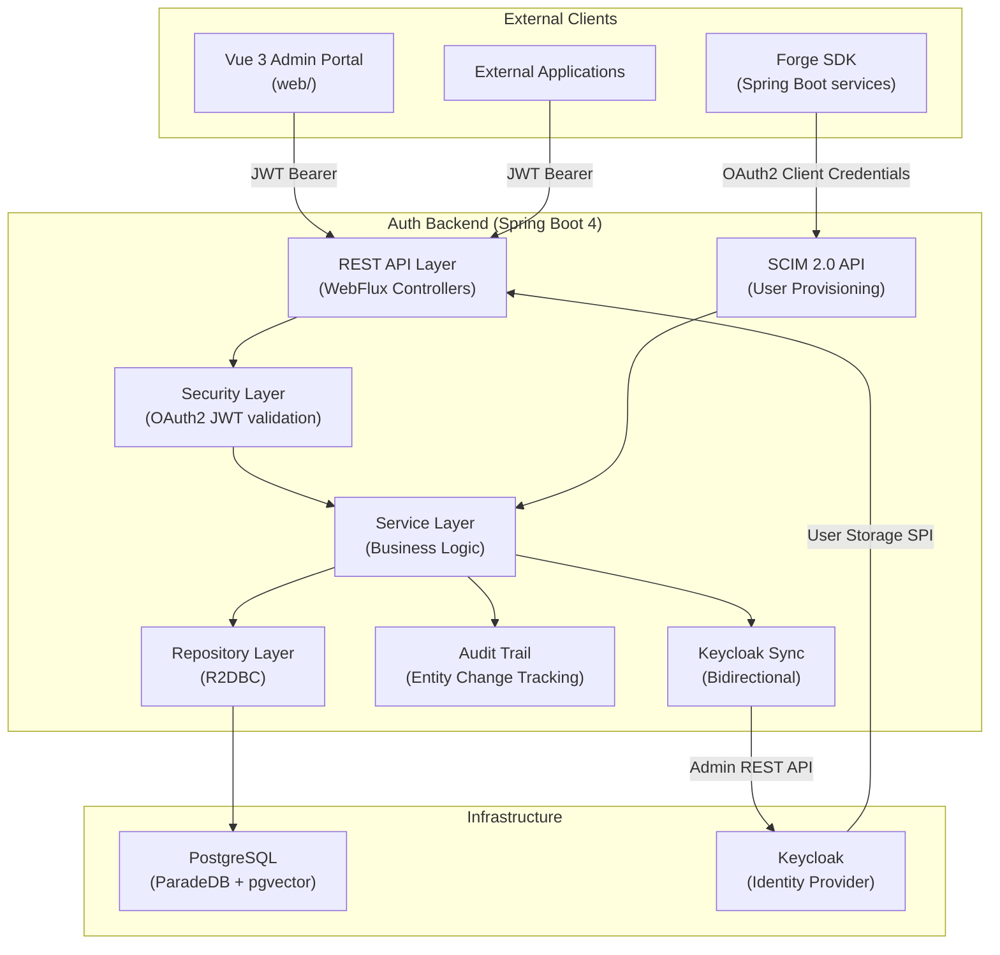
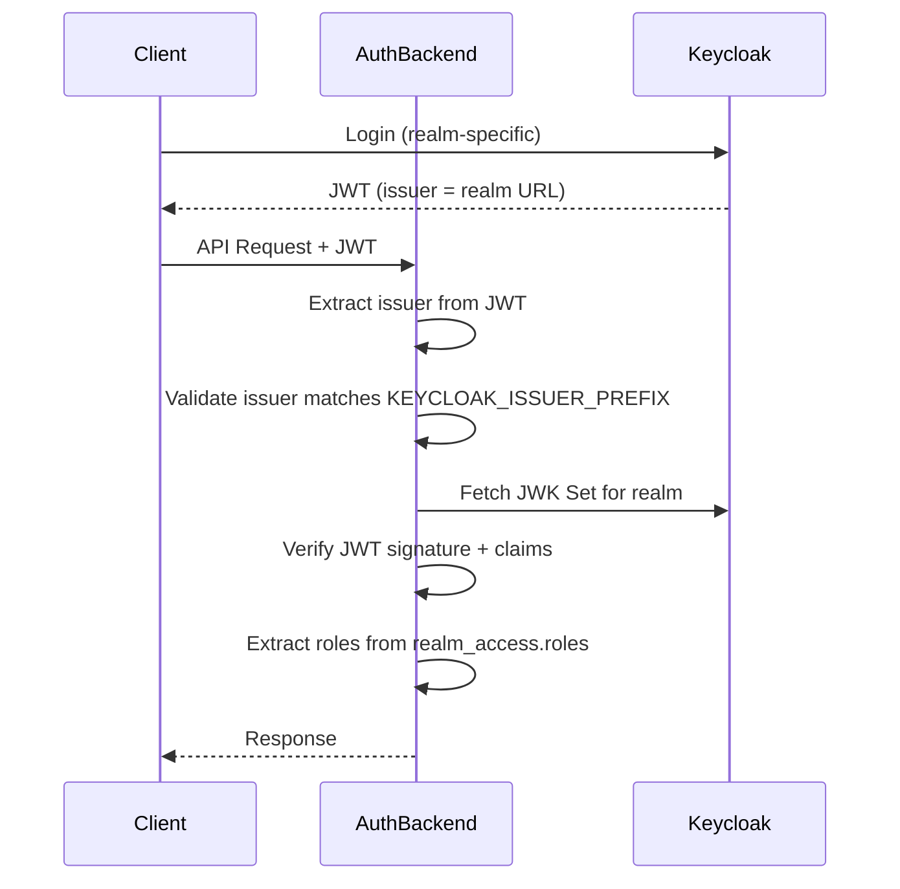
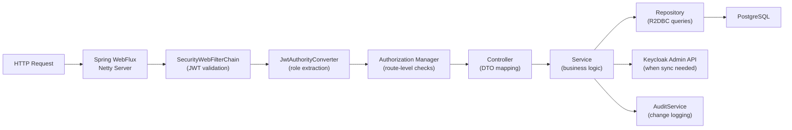
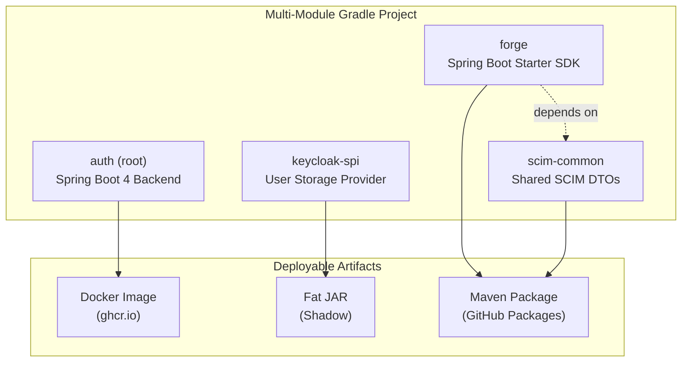
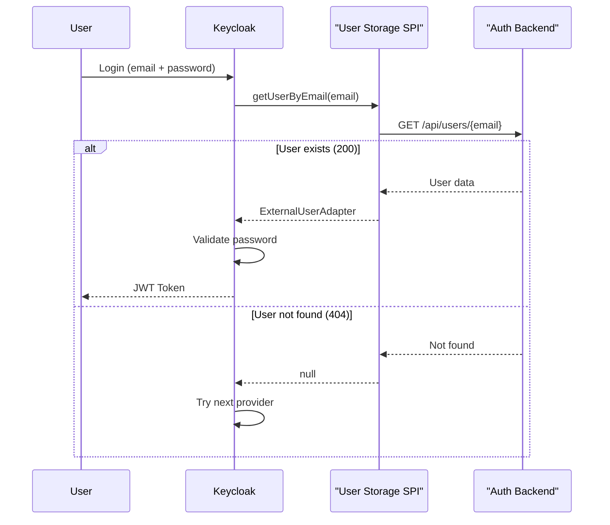
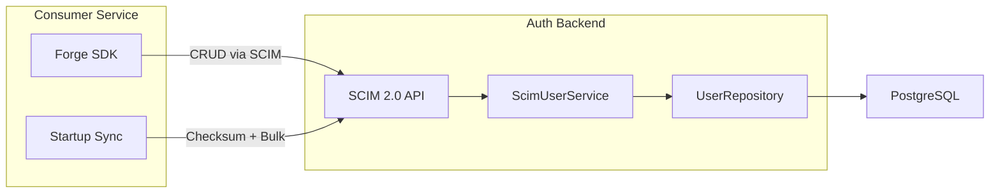

# Architecture

This document explains the high-level architecture of the KOS Auth Backend, how the major components interact, and the design decisions that shape the system.

## System Overview

KOS Auth is a **multi-tenant authentication and identity management backend** that acts as a control plane for Keycloak. It provides a management API for tenants, users, clients, roles, groups, and identity providers, while Keycloak handles the runtime authentication (OAuth2/OIDC token issuance).

## Multi-Tenant Authentication

The system supports multiple Keycloak realms, each representing a tenant. JWT tokens from any realm are accepted, with the issuer dynamically resolved at runtime.

### Key Security Components

| Component | File | Responsibility |
|-----------|------|----------------|
| `SecurityConfig` | `config/SecurityConfig.kt` | Defines route authorization rules and filter chain |
| `JwtAuthorityConverter` | `config/JwtAuthorityConverter.kt` | Extracts `realm_access.roles` from JWT, prefixes with `ROLE_` |
| `SuperAdminAuthorizationManager` | `security/SuperAdminAuthorizationManager.kt` | Validates super admin access via saas-admin realm |
| `SecurityGuards` | `security/SecurityGuards.kt` | Utility functions for realm/role checks |

### API Route Authorization

| Path Pattern | Authorization |
|--------------|---------------|
| `/api/public/**` | Public |
| `/auth/super/login`, `/oauth2/**` | Public (OAuth2 flow) |
| `/api/super/**` | Super admin only (`SuperAdminAuthorizationManager`) |
| `/api/account/**` | `ACCOUNT_ADMIN` or `INSTITUTE_ADMIN` role |
| `/api/scim/v2/**` | Authenticated (OAuth2 JWT) |
| All other routes | Authenticated |

## Request Lifecycle

A typical authenticated API request flows through these layers:

## Module Architecture

The project is organized as a multi-module Gradle build:

| Module | Technology | Purpose | Artifact |
|--------|-----------|---------|----------|
| `auth` (root) | Kotlin, Spring Boot 4, WebFlux, R2DBC | Main backend service | Docker image |
| `keycloak-spi` | Kotlin, Keycloak SPI | Read-only user validation provider | Fat JAR (Shadow) |
| `scim-common` | Kotlin | Shared SCIM 2.0 DTOs and utilities | Maven package |
| `forge` | Kotlin, Spring Boot Starter | Client SDK for SCIM API consumption | Maven package |

## Keycloak Integration

The system integrates with Keycloak in two directions:

### 1. Auth Backend → Keycloak (Admin API)

The `KeycloakAdminClient` uses Keycloak's REST Admin API to manage realms, clients, roles, groups, users, and identity providers. Changes made through the Auth Backend API are pushed to Keycloak.

### 2. Keycloak → Auth Backend (User Storage SPI)

The `keycloak-spi` module deploys a read-only User Storage Provider into Keycloak. During login, Keycloak calls the Auth Backend to validate whether a user exists:

### 3. Bidirectional Sync

The `KeycloakSyncService` synchronizes state between the Auth Backend's database and Keycloak. On startup (when enabled), it pulls realms, clients, roles, groups, and users from Keycloak into shadow tables, enabling the admin UI to render Keycloak state without direct Keycloak API calls.

## SCIM 2.0 Provisioning

The SCIM API enables external services to manage users via a standards-based protocol:

The Forge SDK provides automatic startup sync: it checksums local users against the Auth Backend, and if there's a drift, it performs a bulk sync to reconcile differences.

## Data Flow Patterns

### Entity CRUD with Audit

All entity modifications (clients, roles, groups, IDPs) follow this pattern:

1. Controller receives request, validates DTO
2. Service performs the operation on the database
3. Service calls `KeycloakAdminClient` to sync the change to Keycloak
4. `AuditService` logs the change with before/after JSONB snapshots
5. Response returned to client

### Paired Client Creation

Full-stack applications create linked frontend/backend clients:

1. `POST /api/super/realms/{realm}/applications` with `applicationType: FULL_STACK`
2. Backend creates a public frontend client (`-web` suffix) with redirect URIs
3. Backend creates a confidential backend client (`-backend` suffix) with service accounts
4. Links them via `kc_clients.paired_client_id`
5. Both clients are created in Keycloak
6. Integration snippets are generated for the developer

## Technology Stack

| Layer | Technology | Version |
|-------|-----------|---------|
| Language | Kotlin | 2.2 |
| JVM | Java | 21 |
| Framework | Spring Boot | 4.0 |
| Reactive | Spring WebFlux | (Spring Framework 7) |
| Database Access | R2DBC | (reactive, non-blocking) |
| Migrations | Flyway | (JDBC, not R2DBC) |
| Database | PostgreSQL | 17+ recommended |
| Search | ParadeDB pg_search | BM25 full-text |
| Vectors | pgvector | Semantic search ready |
| Auth | Keycloak | 26.x |
| API Docs | SpringDoc OpenAPI | 3.0 |
| Build | Gradle | Kotlin DSL |
| Observability | Micrometer Tracing | (trace_id, span_id) |
