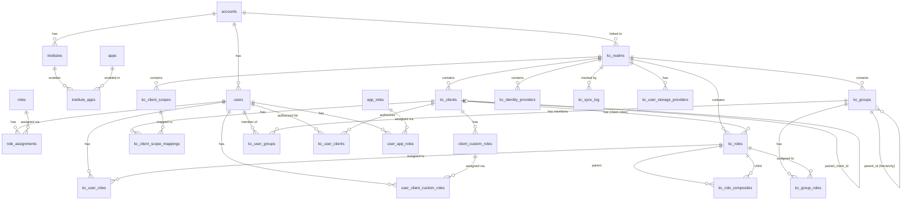

# Database

This document covers the complete database schema, migration history, entity relationships, and search capabilities.

## Overview

The system uses **PostgreSQL** with two key extensions:

- **ParadeDB pg_search**: BM25 full-text search on user fields
- **pgvector**: Vector embeddings for hybrid search (semantic + keyword)

All primary keys use **UUIDv7** (time-ordered UUIDs) via a custom `uuidv7()` function, providing natural chronological ordering and better index performance than random UUIDs.

Database access is fully **reactive** via R2DBC, while migrations run via **Flyway** using JDBC.

## Entity Relationship Diagram



## Migration History

| Version | File | Description |
|---------|------|-------------|
| V0 | `V0__setup_uuidv7.sql` | Creates `uuidv7()` function for time-ordered UUIDs |
| V1 | `V1__admin_schema.sql` | Core tenant model: accounts, institutes, apps, users, roles, role_assignments |
| V2 | `V2__paradedb_extensions.sql` | Installs `pg_search` (BM25) and `vector` (pgvector) extensions |
| V3 | `V3__user_search_and_keycloak_mapping.sql` | Adds user profile fields + BM25 index; creates all Keycloak shadow tables |
| V4 | `V4__realm_management_and_user_realm.sql` | Links users to realms; adds SPI config to realms; creates user storage provider table |
| V5 | `V5__application_roles.sql` | Application roles, custom client roles, user role assignments; adds OAuth flow flags to clients |
| V6 | `V6__audit_trail_and_user_clients.sql` | Entity action log (audit trail); user-client associations |
| V7 | `V7__paired_client_id.sql` | Adds `paired_client_id` to link frontend/backend clients |
| V8 | `V8__client_role_default.sql` | Adds `is_default` flag to client custom roles for onboarding |

## Table Reference

### Core Tenant Tables

#### `accounts`

Top-level tenant. Each account maps to a Keycloak realm.

| Column | Type | Constraints | Description |
|--------|------|-------------|-------------|
| `id` | UUID | PK, default `uuidv7()` | |
| `name` | TEXT | NOT NULL | Account name |
| `slug` | TEXT | NOT NULL, UNIQUE | URL-friendly identifier |
| `keycloak_realm` | TEXT | NOT NULL, UNIQUE | Keycloak realm name |
| `status` | TEXT | CHECK (ACTIVE, SUSPENDED) | |
| `created_at` | TIMESTAMPTZ | NOT NULL, default `now()` | |
| `created_by` | UUID | NOT NULL | Creator user ID |
| `updated_at` | TIMESTAMPTZ | | |

#### `institutes`

Organizational unit within an account.

| Column | Type | Constraints | Description |
|--------|------|-------------|-------------|
| `id` | UUID | PK | |
| `account_id` | UUID | FK → accounts, ON DELETE CASCADE | |
| `name` | TEXT | NOT NULL | |
| `code` | TEXT | NOT NULL, UNIQUE(account_id, code) | |
| `status` | TEXT | CHECK (ACTIVE, ARCHIVED) | |
| `created_at` | TIMESTAMPTZ | NOT NULL | |

#### `apps`

Feature modules that can be enabled per institute.

| Column | Type | Constraints | Description |
|--------|------|-------------|-------------|
| `id` | UUID | PK | |
| `key` | TEXT | NOT NULL, UNIQUE | App identifier |
| `name` | TEXT | NOT NULL | |
| `description` | TEXT | | |
| `created_at` | TIMESTAMPTZ | NOT NULL | |

#### `users`

Shadow user records linked to Keycloak users.

| Column | Type | Constraints | Description |
|--------|------|-------------|-------------|
| `id` | UUID | PK | |
| `keycloak_user_id` | TEXT | NOT NULL, UNIQUE | Keycloak user ID |
| `email` | TEXT | NOT NULL, UNIQUE(account_id, email) | |
| `display_name` | TEXT | | |
| `first_name` | TEXT | | Added in V3 |
| `last_name` | TEXT | | Added in V3 |
| `phone` | TEXT | | Added in V3 |
| `bio` | TEXT | | Added in V3 |
| `job_title` | TEXT | | Added in V3 |
| `department` | TEXT | | Added in V3 |
| `avatar_url` | TEXT | | Added in V3 |
| `status` | TEXT | CHECK (ACTIVE, INACTIVE, SUSPENDED) | Added in V3 |
| `account_id` | UUID | FK → accounts | |
| `realm_id` | UUID | FK → kc_realms | Added in V4 |
| `last_login_at` | TIMESTAMPTZ | | Added in V3 |
| `created_at` | TIMESTAMPTZ | NOT NULL | |
| `updated_at` | TIMESTAMPTZ | | Added in V3 |

**BM25 Index**: `idx_users_bm25` on `email`, `display_name`, `first_name`, `last_name`, `bio`, `job_title`, `department`.

### Keycloak Shadow Tables

#### `kc_realms`

| Column | Type | Description |
|--------|------|-------------|
| `id` | UUID | PK |
| `account_id` | UUID | FK → accounts (nullable) |
| `realm_name` | TEXT | UNIQUE |
| `display_name` | TEXT | |
| `enabled` | BOOLEAN | |
| `keycloak_id` | TEXT | UNIQUE, Keycloak internal ID |
| `spi_enabled` | BOOLEAN | Whether User Storage SPI is configured (V4) |
| `spi_api_url` | TEXT | SPI endpoint URL (V4) |
| `attributes` | JSONB | Custom realm attributes (V4) |
| `synced_at` | TIMESTAMPTZ | Last sync time |

#### `kc_clients`

| Column | Type | Description |
|--------|------|-------------|
| `id` | UUID | PK |
| `realm_id` | UUID | FK → kc_realms |
| `client_id` | TEXT | Keycloak client_id (e.g., "admin-console") |
| `name` | TEXT | Display name |
| `description` | TEXT | |
| `enabled` | BOOLEAN | |
| `public_client` | BOOLEAN | Public vs confidential |
| `protocol` | TEXT | Default: openid-connect |
| `root_url` | TEXT | |
| `base_url` | TEXT | |
| `redirect_uris` | JSONB | Array of redirect URIs |
| `web_origins` | JSONB | Array of web origins |
| `keycloak_id` | TEXT | UNIQUE |
| `paired_client_id` | UUID | FK → kc_clients (V7) |
| `standard_flow_enabled` | BOOLEAN | (V5) |
| `direct_access_grants_enabled` | BOOLEAN | (V5) |
| `service_accounts_enabled` | BOOLEAN | (V5) |
| `authorization_services_enabled` | BOOLEAN | (V5) |

#### `kc_groups`

Hierarchical groups with self-referencing parent.

| Column | Type | Description |
|--------|------|-------------|
| `id` | UUID | PK |
| `realm_id` | UUID | FK → kc_realms |
| `parent_id` | UUID | FK → kc_groups (self-referencing) |
| `name` | TEXT | |
| `path` | TEXT | Full path e.g. "/org/dept/team" |
| `attributes` | JSONB | |
| `keycloak_id` | TEXT | UNIQUE |

#### `kc_roles`

Realm and client roles.

| Column | Type | Description |
|--------|------|-------------|
| `id` | UUID | PK |
| `realm_id` | UUID | FK → kc_realms |
| `client_id` | UUID | FK → kc_clients (NULL = realm role) |
| `name` | TEXT | |
| `description` | TEXT | |
| `composite` | BOOLEAN | |
| `keycloak_id` | TEXT | UNIQUE |

#### `kc_identity_providers`

SSO federation providers (Google, SAML, OIDC).

| Column | Type | Description |
|--------|------|-------------|
| `id` | UUID | PK |
| `realm_id` | UUID | FK → kc_realms |
| `alias` | TEXT | UNIQUE(realm_id, alias) |
| `display_name` | TEXT | |
| `provider_id` | TEXT | e.g., "google", "saml", "oidc" |
| `enabled` | BOOLEAN | |
| `trust_email` | BOOLEAN | |
| `config` | JSONB | Provider-specific config |
| `keycloak_internal_id` | TEXT | UNIQUE |

### Association Tables

| Table | PK/Columns | Description |
|-------|------------|-------------|
| `institute_apps` | (institute_id, app_id) | App enabled per institute |
| `kc_client_scope_mappings` | (client_id, scope_id) + scope_type | Client-to-scope (DEFAULT/OPTIONAL) |
| `kc_role_composites` | (parent_role_id, child_role_id) | Composite role mappings |
| `kc_user_groups` | (user_id, group_id) + assigned_at, assigned_by | User-to-group |
| `kc_user_roles` | (user_id, role_id) + assigned_at, assigned_by | Direct user-to-role |
| `kc_group_roles` | (group_id, role_id) + assigned_at | Group-to-role |
| `kc_user_clients` | (realm_id, user_keycloak_id, client_id) | User authorized for client |
| `account_admins` | (account_id, user_id) | Account admin privileges |

### Application Role Tables

#### `app_roles`

System-wide application roles (not Keycloak-specific).

| Column | Type | Description |
|--------|------|-------------|
| `id` | UUID | PK |
| `name` | TEXT | UNIQUE (e.g., "administrator", "realm_admin") |
| `display_name` | TEXT | |
| `description` | TEXT | |
| `scope` | TEXT | CHECK (global, realm, client) |

**Seeded values**: `administrator` (global), `realm_admin` (realm), `client_admin` (client).

#### `client_custom_roles`

Dynamic roles created by client admins.

| Column | Type | Description |
|--------|------|-------------|
| `id` | UUID | PK |
| `client_id` | UUID | FK → kc_clients |
| `name` | TEXT | UNIQUE(client_id, name) |
| `display_name` | TEXT | |
| `description` | TEXT | |
| `is_default` | BOOLEAN | Default role for onboarding (V8). Partial unique index ensures one per client. |
| `created_by` | UUID | FK → users |

### Audit Trail

#### `entity_action_log`

| Column | Type | Description |
|--------|------|-------------|
| `id` | UUID | PK |
| `actor_keycloak_id` | TEXT | JWT `sub` claim |
| `actor_email` | TEXT | JWT `email` claim |
| `actor_display_name` | TEXT | |
| `actor_issuer` | TEXT | JWT `iss` claim |
| `action_type` | TEXT | CHECK (CREATE, UPDATE, DELETE) |
| `entity_type` | TEXT | CHECK (CLIENT, REALM, ROLE, GROUP, IDP, USER) |
| `entity_id` | UUID | |
| `entity_keycloak_id` | TEXT | |
| `entity_name` | TEXT | |
| `realm_name` | TEXT | |
| `realm_id` | UUID | FK → kc_realms |
| `before_state` | JSONB | Snapshot before change |
| `after_state` | JSONB | Snapshot after change |
| `changed_fields` | TEXT[] | Array of changed field names |
| `reverted` | BOOLEAN | Whether this action was reverted |
| `reverted_at` | TIMESTAMPTZ | |
| `reverted_by_keycloak_id` | TEXT | |
| `revert_reason` | TEXT | |
| `revert_of_action_id` | UUID | FK → entity_action_log (self-ref) |
| `created_at` | TIMESTAMPTZ | |

### Sync Tracking

#### `kc_sync_log`

| Column | Type | Description |
|--------|------|-------------|
| `id` | UUID | PK |
| `realm_id` | UUID | FK → kc_realms |
| `entity_type` | TEXT | REALM, CLIENT, CLIENT_SCOPE, GROUP, ROLE, USER, IDP |
| `sync_direction` | TEXT | FROM_KC, TO_KC |
| `status` | TEXT | STARTED, COMPLETED, FAILED |
| `entities_processed` | INTEGER | |
| `error_message` | TEXT | |
| `started_at` | TIMESTAMPTZ | |
| `completed_at` | TIMESTAMPTZ | |

## Full-Text Search

ParadeDB BM25 index on the `users` table:

```sql
-- Search users by name (match any term)
SELECT id, email, display_name, pdb.score(id) as relevance
FROM users
WHERE (email, display_name, first_name, last_name) ||| 'john developer'
  AND account_id = :account_id
ORDER BY relevance DESC;

-- Search with all terms matching
SELECT id, email, display_name
FROM users
WHERE (email, display_name, first_name, last_name) &&& 'john doe'
  AND realm_id = :realm_id;
```

| Operator | Description |
|----------|-------------|
| `\|\|\|` | Match any term (OR) |
| `&&&` | Match all terms (AND) |

### Index Configuration

The BM25 index uses ICU tokenization for name fields and raw tokenization for emails:

- `email`: raw tokenizer (exact match), fast field
- `display_name`, `first_name`, `last_name`: ICU tokenizer, fast field
- `bio`: ICU tokenizer (not fast — lower priority)
- `job_title`, `department`: ICU tokenizer, fast field

## Index Summary

| Index | Table | Columns | Type |
|-------|-------|---------|------|
| `idx_users_bm25` | users | email, display_name, first_name, last_name, bio, job_title, department | BM25 |
| `idx_institutes_account_id` | institutes | account_id | B-tree |
| `idx_users_account_id` | users | account_id | B-tree |
| `idx_users_realm_id` | users | realm_id | B-tree |
| `idx_kc_realms_account_id` | kc_realms | account_id | B-tree |
| `idx_kc_clients_realm_id` | kc_clients | realm_id | B-tree |
| `idx_kc_clients_paired_client_id` | kc_clients | paired_client_id | B-tree |
| `idx_kc_groups_realm_id` | kc_groups | realm_id | B-tree |
| `idx_kc_groups_parent_id` | kc_groups | parent_id | B-tree |
| `idx_kc_groups_path` | kc_groups | path | B-tree |
| `idx_kc_roles_realm_id` | kc_roles | realm_id | B-tree |
| `idx_kc_roles_client_id` | kc_roles | client_id | B-tree |
| `idx_kc_roles_realm_name` | kc_roles | realm_id, name (WHERE client_id IS NULL) | Unique partial |
| `idx_kc_roles_client_name` | kc_roles | client_id, name (WHERE client_id IS NOT NULL) | Unique partial |
| `idx_action_log_actor` | entity_action_log | actor_keycloak_id | B-tree |
| `idx_action_log_entity` | entity_action_log | entity_type, entity_id | B-tree |
| `idx_action_log_realm` | entity_action_log | realm_name | B-tree |
| `idx_action_log_created` | entity_action_log | created_at DESC | B-tree |
| `idx_action_log_not_reverted` | entity_action_log | created_at DESC WHERE reverted=false | Partial |
