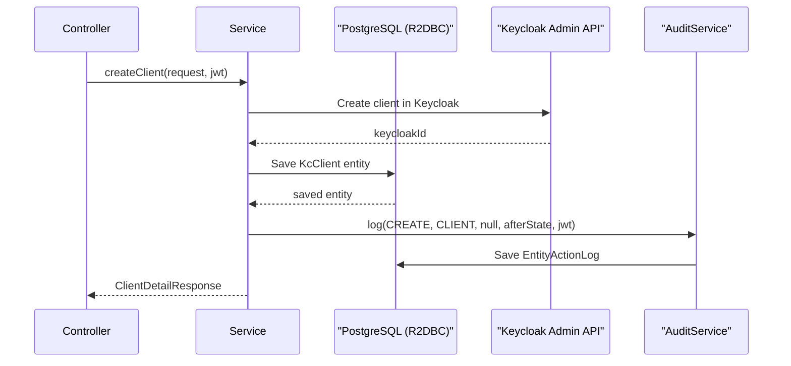
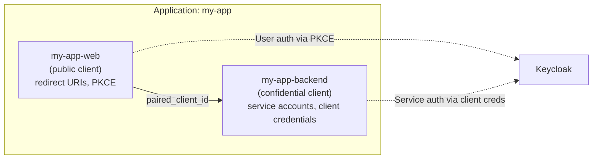

# Design

This document explains the internal design patterns, code organization, and key design decisions in the KOS Auth Backend.

## Package Structure

The backend follows a **feature-based package structure** where each domain area is a top-level package containing its own controllers, services, DTOs, and entities:

```
com.keeplearning.auth/
├── audit/                  # Audit trail (entity change tracking + revert)
│   ├── controller/         #   AuditController
│   ├── domain/             #   EntityActionLog, repository
│   ├── dto/                #   AuditDtos
│   └── service/            #   AuditService, AuditQueryService, RevertService
├── auth/                   # Super admin authentication
│   ├── SuperAdminAuthController
│   └── SuperAdminMeResponse
├── client/                 # Client-scoped operations (onboarding, roles, users)
│   ├── controller/         #   ClientOnboardingController, ClientRoleController, ClientUserController
│   ├── dto/                #   ClientRoleDtos, ClientUserDtos
│   └── service/            #   ClientOnboardingService, ClientRoleService, ClientUserService
├── config/                 # Spring configuration
│   ├── JwtAuthorityConverter
│   ├── KeycloakAdminConfig
│   ├── OpenApiConfig
│   ├── R2dbcConfig
│   ├── SecurityConfig
│   ├── WebClientConfig
│   └── WebFluxVersioningConfig
├── domain/                 # Shared domain model
│   ├── entity/             #   All R2DBC entities
│   ├── repository/         #   All R2DBC repositories
│   └── types/              #   Custom types (JsonValue)
├── exception/              # Global exception handling
├── keycloak/               # Keycloak admin integration
│   ├── client/             #   KeycloakAdminClient, DTOs
│   ├── controller/         #   AccountUserRoleController, KeycloakUserManagementController
│   ├── service/            #   AccountUserRoleService, KeycloakUserManagementService
│   └── sync/               #   KeycloakSyncService, StartupSyncRunner
├── public/                 # Public (unauthenticated) endpoints
│   ├── controller/         #   PublicUserController
│   └── dto/                #   PublicUserResponse
├── realm/                  # Realm-scoped Keycloak entity management
│   ├── controller/         #   ClientController, GroupController, IdpController,
│   │                       #   RealmController, RoleController, UserController
│   ├── dto/                #   ClientDtos, GroupDtos, IdpDtos, IntegrationSnippetsDtos,
│   │                       #   RealmDtos, RoleDtos, UserDtos
│   └── service/            #   ClientService, GroupService, IdpService,
│                           #   RealmService, RoleService, UserService
├── scim/                   # SCIM 2.0 provisioning API
│   ├── ScimBulkController, ScimBulkService
│   ├── ScimChecksumController, ScimChecksumService
│   ├── ScimDiscoveryController
│   ├── ScimUserController, ScimUserService, ScimUserMapper
│   ├── ScimFilterTranslator, ScimDtos
│   └── ScimException, ScimExceptionHandler
└── security/               # Authorization utilities
    ├── SecurityGuards
    └── SuperAdminAuthorizationManager
```

## Design Patterns

### Reactive Programming Model

The entire stack is reactive (non-blocking). All database access uses R2DBC with `Mono<T>` and `Flux<T>` return types. Controllers and services use Kotlin coroutines via `suspend` functions, bridging the reactive types with `awaitSingle()` and `awaitSingleOrNull()`.

```
Controller (suspend fun) → Service (suspend fun) → Repository (Mono/Flux) → R2DBC → PostgreSQL
                                                  ↘ KeycloakAdminClient (WebClient, suspend)
```

### Dual-Write with Audit

Entity mutations follow a dual-write pattern: write to the local database, then sync to Keycloak, then log the audit trail. This ensures:

1. **Local database is source of truth** for the admin UI
2. **Keycloak is kept in sync** for runtime authentication
3. **Audit trail** captures who changed what, when, with before/after snapshots



### Shadow Tables

Keycloak entities are mirrored in PostgreSQL "shadow tables" (`kc_realms`, `kc_clients`, `kc_roles`, etc.). This pattern serves several purposes:

- **Fast queries**: The admin portal queries the local DB instead of Keycloak's API
- **Relationship management**: SQL joins across entities (e.g., "clients in realm X")
- **Extended metadata**: Custom fields not supported by Keycloak (e.g., `paired_client_id`)
- **Audit trail**: Changes are tracked with JSONB snapshots

The `KeycloakSyncService` runs at startup to pull Keycloak state into these tables. After that, all mutations go through the Auth Backend API, which writes to both the DB and Keycloak.

### Entity-Scoped Controllers

Each Keycloak entity type has its own controller under the `realm/` package, following a consistent URL pattern:

```
/api/super/realms/{realmName}/clients
/api/super/realms/{realmName}/clients/{clientId}
/api/super/realms/{realmName}/roles
/api/super/realms/{realmName}/groups
/api/super/realms/{realmName}/identity-providers
/api/super/realms/{realmName}/users
```

This maps cleanly to Keycloak's own resource hierarchy and makes the API predictable.

### Paired Client Pattern

Full-stack applications need two OAuth2 clients: a public frontend client and a confidential backend client. Instead of managing them independently, the system creates them as a pair:



The `ClientService.createApplication()` method handles the paired creation, and `IntegrationSnippetGenerator` produces ready-to-use code snippets for the developer.

### SCIM Filter Translation

The `ScimFilterTranslator` converts SCIM filter expressions (RFC 7644 §3.4.2.2) into R2DBC SQL `WHERE` clauses. This enables the Forge SDK to query users with standard SCIM filters:

```
SCIM: userName eq "john@example.com" and active eq true
 SQL: WHERE email = 'john@example.com' AND status = 'ACTIVE'
```

Supported SCIM operators: `eq`, `ne`, `co`, `sw`, `ew`, `gt`, `ge`, `lt`, `le`, with `and`/`or` logical operators.

## API Versioning

SCIM endpoints use **header-based API versioning** via Spring Framework 7:

```
API-Version: 1.0
```

The `WebFluxVersioningConfig` configures Spring to inspect this header. Non-SCIM endpoints are unaffected.

## Error Handling

| Layer | Handler | Error Format |
|-------|---------|-------------|
| SCIM API | `ScimExceptionHandler` | RFC 7644 §3.12 (`ScimErrorResponse`) |
| REST API | `GlobalExceptionHandler` | Standard Spring error response |
| Keycloak API | `KeycloakAdminClient` | Maps Keycloak HTTP errors to `ResponseStatusException` |

## Configuration Strategy

The application uses Spring Boot's property binding with environment variable overrides:

| Config Source | Purpose |
|---------------|---------|
| `application.yml` | Default values, profiles |
| Environment variables | Runtime overrides (`DB_HOST`, `KEYCLOAK_BASE_URL`, etc.) |
| `keycloak.*` properties | Custom Keycloak admin config (not Spring Security) |

### Key Configuration Properties

```yaml
# Spring Security OAuth2 (runtime JWT validation)
spring.security.oauth2.client.registration.master.*

# Keycloak Admin API (management operations)
keycloak.admin.base-url
keycloak.admin.client-id
keycloak.admin.client-secret

# User Storage SPI
keycloak.spi.provider-id
keycloak.spi.default-api-url

# Keycloak Sync
keycloak.sync.enabled
```

## Concurrency Model

Spring WebFlux runs on a small, fixed thread pool (typically CPU core count). All I/O is non-blocking:

- **Database**: R2DBC driver uses async I/O
- **Keycloak API**: `WebClient` (non-blocking HTTP)
- **Controllers**: Kotlin coroutines bridge reactive types

This means the server can handle thousands of concurrent connections with a small thread pool, making it suitable for a management control plane that serves many tenants.

## Security Model

### Multi-Tenant JWT Validation

The `JwtIssuerReactiveAuthenticationManagerResolver` dynamically validates JWTs from any realm:

1. Extract `iss` claim from incoming JWT
2. Verify it starts with `KEYCLOAK_ISSUER_PREFIX` (e.g., `https://auth.example.com/realms/`)
3. Fetch the JWK Set for that specific realm
4. Validate signature, expiry, and claims
5. Extract roles via `JwtAuthorityConverter`

### Super Admin vs Tenant Admin

- **Super Admin**: Tokens from the `saas-admin` realm with `ROLE_SUPER_ADMIN`. Full access to `/api/super/**` endpoints (cross-realm management).
- **Tenant Admin**: Tokens from any tenant realm with `ROLE_ACCOUNT_ADMIN` or `ROLE_INSTITUTE_ADMIN`. Scoped to `/api/account/**` endpoints.

## Observability

- **Structured logging**: `trace_id` and `span_id` in every log line via Micrometer Tracing
- **OpenAPI docs**: Auto-generated at `/v3/api-docs`, Swagger UI at `/swagger-ui.html`
- **Audit trail**: Every entity mutation is logged with actor info and before/after state
