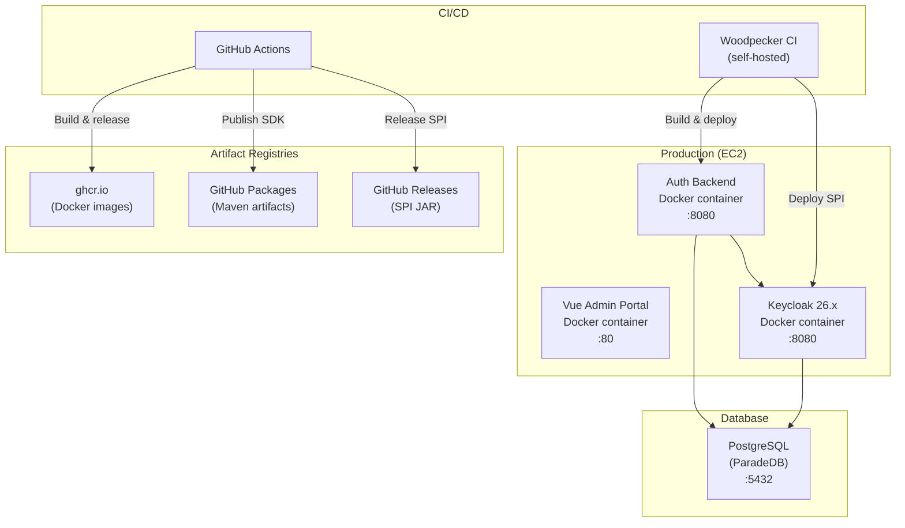
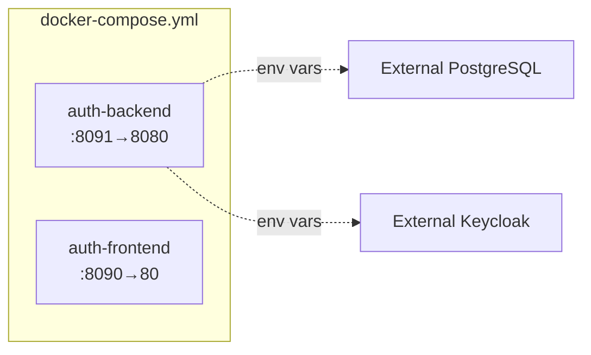
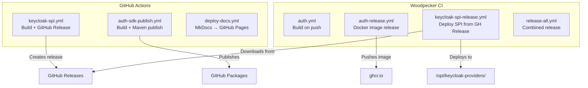

# Infrastructure

This document covers deployment topology, Docker setup, CI/CD pipelines, and operational concerns.

## Deployment Topology



## Docker Compose (Local Development)



### Services

| Service | Image | Host Port | Container Port | Description |
|---------|-------|-----------|----------------|-------------|
| `auth-backend` | `ghcr.io/ravencloak-org/ravencloak:latest` | 8091 | 8080 | Auth backend |
| `auth-frontend` | `ghcr.io/ravencloak-org/ravencloak-web:latest` | 8090 | 80 | Vue admin portal |

For local development with infrastructure services (ParadeDB + Keycloak), a separate docker-compose setup is available:

| Service | Image | Port | Purpose |
|---------|-------|------|---------|
| `paradedb` | `paradedb/paradedb:latest` | 5234 | PostgreSQL + BM25 + pgvector |
| `keycloak` | `quay.io/keycloak/keycloak:26.5.0` | 8088 | Identity provider |

### Running Locally

```bash
# Infrastructure only (app runs via Gradle)
docker compose up -d paradedb keycloak
./gradlew bootRun

# Full stack via Docker
docker compose up -d
```

## CI/CD Pipelines

### Pipeline Architecture



### GitHub Actions Workflows

| Workflow | File | Trigger | Produces |
|----------|------|---------|----------|
| Keycloak SPI | `keycloak-spi.yml` | Push to `keycloak-spi/**`, tag `spi-v*`, manual | GitHub Release with fat JAR |
| Forge SDK | `auth-sdk-publish.yml` | Push to `forge/**`/`scim-common/**`, tag `sdk-v*`, manual | Maven package on GitHub Packages |
| Documentation | `deploy-docs.yml` | Push to `docs/**`/`mkdocs.yml`, release published, manual | MkDocs site on GitHub Pages |

### Woodpecker CI Pipelines

| Pipeline | File | Trigger | Action |
|----------|------|---------|--------|
| Auth Build | `auth.yml` | Push to `src/**` | Compile and test |
| Auth Release | `auth-release.yml` | Tag `v*` | Build Docker image, push to ghcr.io, deploy |
| SPI Deploy | `keycloak-spi-release.yml` | Manual (`DEPLOY_TO=keycloak-spi`) | Download JAR from GitHub Release, deploy to Keycloak |
| Combined | `release-all.yml` | Tag `release-v*` or manual | Release auth backend + deploy SPI |

### Release Commands

```bash
# Tag-based releases
git tag v1.0.0 && git push origin v1.0.0           # Auth backend
git tag spi-v1.0.0 && git push origin spi-v1.0.0     # Keycloak SPI
git tag release-v1.0.0 && git push origin release-v1.0.0  # Combined

# Manual via CLI
gh workflow run keycloak-spi.yml -f version=1.0.1     # SPI via GitHub Actions
gh workflow run auth-sdk-publish.yml -f version=0.2.0  # SDK via GitHub Actions
woodpecker-cli pipeline create dsjkeeplearning/kos-auth-backend \
  --branch main --var DEPLOY_TO=keycloak-spi           # SPI deploy via Woodpecker
```

## Build System

### Gradle Multi-Module Build

```
settings.gradle.kts          # Includes: keycloak-spi, scim-common, forge
build.gradle.kts              # Root: Spring Boot 4, Kotlin 2.2, Java 21
├── keycloak-spi/
│   └── build.gradle.kts      # Shadow JAR (fat JAR with relocated Kotlin stdlib)
├── scim-common/
│   └── build.gradle.kts      # Library (SCIM DTOs)
└── forge/
    └── build.gradle.kts      # Spring Boot Starter (depends on scim-common)
```

### Build Cache Strategy

| Cache Type | Scope | Technology |
|-----------|-------|-----------|
| Local Gradle cache | Developer machine | `org.gradle.caching=true` |
| S3 remote build cache | CI + team | Cloudflare R2 via `com.github.burrunan.s3-build-cache` |
| Gradle dependency cache | CI | Volume mount `/var/lib/woodpecker/cache/gradle` |
| Docker layer cache | CI | Registry-based cache at `ghcr.io/.../kos-auth-backend:cache` |

### Build Optimizations (`gradle.properties`)

```properties
org.gradle.parallel=true              # Parallel module builds
org.gradle.caching=true               # Local build cache
org.gradle.configuration-cache=true   # Cache task graph
```

## Deployment Flow

### Auth Backend Deployment

1. Tag pushed (`v*`) or combined release triggered
2. Woodpecker builds Docker image with Jib or Dockerfile
3. Image pushed to `ghcr.io/ravencloak-org/ravencloak:<version>`
4. On deployment server: pull image, stop old container, start new container
5. README version badge updated

### Keycloak SPI Deployment

1. GitHub Actions builds `keycloak-spi` via `shadowJar` (fat JAR)
2. Creates GitHub Release with the JAR as an asset
3. Woodpecker (manual or triggered) downloads JAR from the release
4. Copies JAR to `/opt/keycloak-providers/` on the host
5. Keycloak container restarted to load the new SPI

### Forge SDK Publishing

1. GitHub Actions builds `forge` and `scim-common` modules
2. Runs tests
3. Publishes to GitHub Packages (Maven repository)

## Environment Variables

### Required (Production)

| Variable | Description | Example |
|----------|-------------|---------|
| `DB_HOST` | PostgreSQL host | `paradedb` |
| `DB_PORT` | PostgreSQL port | `5432` |
| `DB_NAME` | Database name | `kos-auth` |
| `DB_USERNAME` | Database user | `postgres` |
| `DB_PASSWORD` | Database password | |
| `KEYCLOAK_BASE_URL` | Keycloak internal URL | `http://keycloak:8080` |
| `KEYCLOAK_ISSUER_PREFIX` | JWT issuer prefix | `https://auth.example.com/realms/` |
| `KEYCLOAK_SAAS_ISSUER_URI` | SaaS admin issuer | `https://auth.example.com/realms/saas-admin` |
| `KEYCLOAK_ADMIN_CLIENT_ID` | Keycloak admin client ID | `admin-cli` |
| `KEYCLOAK_ADMIN_CLIENT_SECRET` | Keycloak admin client secret | |
| `SAAS_ADMIN_CLIENT_SECRET` | OAuth2 client secret | |

### Optional

| Variable | Default | Description |
|----------|---------|-------------|
| `KEYCLOAK_SYNC_ENABLED` | `true` | Enable startup Keycloak sync |
| `SERVER_FORWARD_HEADERS_STRATEGY` | — | Set to `framework` behind reverse proxy |
| `OTEL_SDK_DISABLED` | — | Disable OpenTelemetry |

## Operational Notes

### ARM64/Graviton Compatibility

The CI runs on ARM64/Graviton EC2. Key compatibility notes:

- Use `amazoncorretto:21` Docker base image (not `eclipse-temurin:21-jdk` which crashes with SIGSEGV on ARM64)
- JVM args must be set via `org.gradle.jvmargs` in `gradle.properties`, not `GRADLE_OPTS` (which only affects the Gradle client launcher, not the daemon)

### Health Checks

- **Auth Backend**: Spring Actuator at `/actuator/health`
- **PostgreSQL**: `pg_isready` (used in Docker Compose health check)
- **Keycloak**: Built-in health endpoint

### Observability

- **Structured logging**: Every log line includes `trace_id` and `span_id`
- **Log format**: `%d{yyyy-MM-dd HH:mm:ss.SSS} [%thread] %-5level [trace_id=%X{trace_id} span_id=%X{span_id}] %logger{36} - %msg%n`
- **Tracing**: Micrometer Tracing with 100% sampling (configurable via `management.tracing.sampling.probability`)
