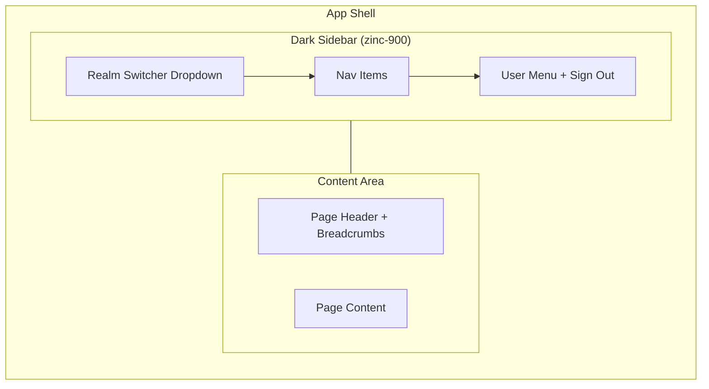
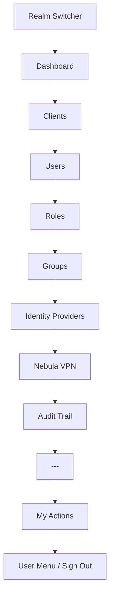
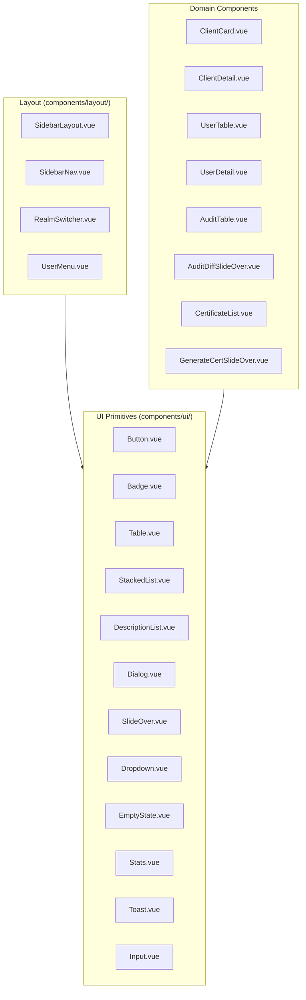
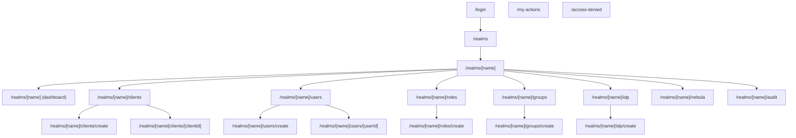

# Frontend Redesign: Catalyst-Style Vue 3 Admin Portal

**Date:** 2026-04-02  
**Status:** Approved  
**Scope:** Complete frontend UI redesign — migrate from PrimeVue to Tailwind CSS + Headless UI, port Catalyst design patterns to Vue 3

---

## 1. Motivation

The current admin portal uses PrimeVue 4 (Aura theme). While functional, it looks generic. The goal is a best-in-class SaaS admin experience using Tailwind Plus (Tailwind UI) — specifically porting [Catalyst](https://tailwindui.com/templates/catalyst)'s dark-first design language to Vue 3.

Catalyst is React-only. The strategy: use `@headlessui/vue` (official Vue port of the same accessibility primitives) and replicate Catalyst's exact Tailwind class patterns in Vue SFCs.

---

## 2. Design Principles

- **Dark mode first** — dark zinc sidebar, content area toggles dark/light
- **Information density over decoration** — show data, not chrome
- **One realm in focus** — sidebar-top dropdown switches realm context
- **Slide-overs over modals** — create/edit forms use slide-over panels, not blocking dialogs
- **Consistent component vocabulary** — ~12 reusable primitives, used everywhere

---

## 3. Layout Architecture



### Sidebar Navigation Items



---

## 4. Color System

| Token | Value | Usage |
|-------|-------|-------|
| **Neutral** | Zinc scale | Sidebar, borders, text, backgrounds |
| **Primary** | Indigo | Active nav, primary buttons, links |
| **Danger** | Red | Delete actions, error states |
| **Warning** | Amber | Expiry warnings, caution badges |
| **Success** | Emerald | Enabled states, success toasts |

Typography: **Inter** (already in use), `text-sm` base, `font-semibold` headings. Follows Catalyst's type scale.

---

## 5. Component Library

Reusable Vue SFCs porting Catalyst's patterns:



### Component Specifications

| Component | Headless UI Primitive | Purpose |
|-----------|----------------------|---------|
| `Button` | — | Primary (indigo), secondary (zinc), danger (red), ghost variants |
| `Badge` | — | Status dots + labels (enabled/disabled, public/confidential, etc.) |
| `Table` | — | Sortable columns, row click, pagination footer |
| `StackedList` | — | Card-style list for clients, roles, groups, IDPs |
| `DescriptionList` | — | Key-value layout for detail pages |
| `Dialog` | `DialogPanel` | Confirmation dialogs (delete, revert) |
| `SlideOver` | `DialogPanel` | Create/edit forms slide in from right |
| `Dropdown` | `Menu` | Realm switcher, user menu, action menus |
| `EmptyState` | — | Illustrated placeholder when lists are empty |
| `Stats` | — | Dashboard summary cards with label + value + trend |
| `Toast` | `Transition` | Success/error notifications, auto-dismiss |
| `Input` | — | Text, select, textarea with label + error state |

---

## 6. Page Wireframes

Every page below is shown as an ASCII wireframe. The left sidebar is consistent across all authenticated pages.

### 6.1 Login (`/login`)

```
+------------------------------------------------------------------+
|                                                                    |
|                         (dark background)                          |
|                                                                    |
|                    +----------------------------+                  |
|                    |                            |                  |
|                    |      [Ravencloak Logo]     |                  |
|                    |                            |                  |
|                    |   Multi-tenant auth admin  |                  |
|                    |                            |                  |
|                    |  +----------------------+  |                  |
|                    |  | Sign in with Keycloak|  |                  |
|                    |  +----------------------+  |                  |
|                    |                            |                  |
|                    +----------------------------+                  |
|                                                                    |
+------------------------------------------------------------------+
```

- No sidebar, full-page centered card
- Single CTA redirects to Keycloak
- After auth, redirects to `/realms`

### 6.2 Realm Dashboard (`/realms/[name]`)

```
+-------+----------------------------------------------------------+
|       |  Dashboard                                                |
| SIDE  |----------------------------------------------------------|
| BAR   |  +------------+ +------------+ +----------+ +----------+ |
|       |  | Clients    | | Users      | | Roles    | | Groups   | |
|       |  |     12     | |     148    | |    8     | |    5     | |
| +---+ |  +------------+ +------------+ +----------+ +----------+ |
| |Rlm| |                                                          |
| |Swi| |  Recent Activity                                         |
| |tch| |  +-------------------------------------------------+    |
| +---+ |  | * admin@co created client "web-app"    2 min ago |    |
|       |  | * admin@co updated role "editor"       1 hr ago  |    |
| Dash  |  | * admin@co added IDP "google-sso"      3 hr ago  |    |
| Clnts |  | * admin@co created user "jane@co"      5 hr ago  |    |
| Users |  | * admin@co synced realm                 1 day ago |    |
| Roles |  +-------------------------------------------------+    |
| Grps  |                                                          |
| IDP   |  Quick Actions                                           |
| Nebula|  [+ Create Client]  [+ Add User]  [Sync Realm]          |
| Audit |                                                          |
|       |                                                          |
| ---   |                                                          |
| MyAct |                                                          |
| [ava] |                                                          |
+-------+----------------------------------------------------------+
```

- 4 stat cards in a row (click-through to respective list page)
- Mini audit timeline (last 5 events)
- Quick action buttons for most common tasks

### 6.3 Clients List (`/realms/[name]/clients`)

```
+-------+----------------------------------------------------------+
|       |  Clients                              [+ Create App]      |
| SIDE  |----------------------------------------------------------|
| BAR   |  [Applications]  [Custom Clients]                        |
|       |                                                          |
|       |  +----------------------------------------------------+  |
|       |  | my-web-app                    Full Stack   * active |  |
|       |  | Frontend + Backend paired        3 redirect URIs   |  |
|       |  +----------------------------------------------------+  |
|       |  | api-service                   Backend     * active |  |
|       |  | Confidential client              Service accounts  |  |
|       |  +----------------------------------------------------+  |
|       |  | admin-portal                  Frontend    * active |  |
|       |  | Public client                    1 redirect URI    |  |
|       |  +----------------------------------------------------+  |
|       |  | legacy-client                 Custom     o disabled|  |
|       |  | Direct access grants enabled                       |  |
|       |  +----------------------------------------------------+  |
|       |                                                          |
|       |                                                          |
+-------+----------------------------------------------------------+
```

- Tabs: "Applications" (auto-paired) vs "Custom Clients"
- Stacked list cards with type badge, status dot, metadata
- Click card -> detail page
- Create button opens slide-over

### 6.4 Client Detail (`/realms/[name]/clients/[clientId]`)

```
+-------+----------------------------------------------------------+
|       |  < Back to Clients                                        |
| SIDE  |                                                          |
| BAR   |  my-web-app                        [* Enabled] [Delete]  |
|       |----------------------------------------------------------|
|       |  [Settings]  [URLs]  [Secrets]  [Integration]  [Paired]  |
|       |                                                          |
|       |  Settings                                                |
|       |  +----------------------------------------------------+  |
|       |  | Client ID        | my-web-app-web                 |  |
|       |  | Client Type      | Public                         |  |
|       |  | Application Type | Full Stack (Frontend)          |  |
|       |  | Standard Flow    | Enabled                        |  |
|       |  | Direct Access    | Disabled                       |  |
|       |  | Service Accounts | Disabled                       |  |
|       |  | Root URL         | https://app.example.com        |  |
|       |  | Created          | 2026-03-15 10:30               |  |
|       |  +----------------------------------------------------+  |
|       |                                                          |
|       |  Paired Backend Client                                   |
|       |  +----------------------------------------------------+  |
|       |  | my-web-app-backend (confidential)      [View ->]   |  |
|       |  +----------------------------------------------------+  |
|       |                                                          |
+-------+----------------------------------------------------------+
```

- Back link at top
- Tabbed sections: Settings (description list), URLs (editable redirect URIs + web origins), Secrets (copy/regenerate), Integration (code snippets), Paired (link to paired client)
- Delete button with confirmation dialog

### 6.5 Create Application (Slide-Over)

```
+-------+-----------------------------------+---------------------+
|       |  (dimmed content behind)           | Create Application  |
| SIDE  |                                    |---------------------|
| BAR   |                                    | Application Name    |
|       |                                    | [________________]  |
|       |                                    |                     |
|       |                                    | Type                |
|       |                                    | ( ) Frontend Only   |
|       |                                    | (x) Full Stack      |
|       |                                    | ( ) Backend Only    |
|       |                                    |                     |
|       |                                    | Root URL            |
|       |                                    | [________________]  |
|       |                                    |                     |
|       |                                    | Redirect URIs       |
|       |                                    | [________________]  |
|       |                                    | [+ Add another]     |
|       |                                    |                     |
|       |                                    | Web Origins         |
|       |                                    | [________________]  |
|       |                                    | [+ Add another]     |
|       |                                    |                     |
|       |                                    | [Cancel]  [Create]  |
|       |                                    +---------------------+
+-------+----------------------------------------------------------+
```

- Slides in from right, dims content behind
- Form fields with validation
- URL fields auto-format (via existing `urlTransform.ts`)

### 6.6 Users List (`/realms/[name]/users`)

```
+-------+----------------------------------------------------------+
|       |  Users                                    [+ Add User]    |
| SIDE  |----------------------------------------------------------|
| BAR   |  [Search users________________________] [Search]          |
|       |                                                          |
|       |  +------+----------+------------------+--------+-------+ |
|       |  | User | Name     | Email            | Status | Login | |
|       |  +------+----------+------------------+--------+-------+ |
|       |  | [av] | Jane Doe | jane@company.com | Active | 2h ago| |
|       |  | [av] | John S.  | john@company.com | Active | 1d ago| |
|       |  | [av] | Bob K.   | bob@company.com  | Invite | Never | |
|       |  | [av] | Alice M. | alice@company.com| Active | 5m ago| |
|       |  | [av] | Tom B.   | tom@company.com  | Locked | 3d ago| |
|       |  +------+----------+------------------+--------+-------+ |
|       |                                                          |
|       |              < 1  2  3  ...  12 >                        |
|       |                                                          |
+-------+----------------------------------------------------------+
```

- Full table with avatar, name, email, status badge, last login
- Search bar triggers BM25 full-text search
- Click row -> user detail
- Pagination footer

### 6.7 User Detail (`/realms/[name]/users/[userId]`)

```
+-------+----------------------------------------------------------+
|       |  < Back to Users                                          |
| SIDE  |                                                          |
| BAR   |  [avatar]  Jane Doe                [Active]   [Delete]   |
|       |            jane@company.com                               |
|       |----------------------------------------------------------|
|       |                                                          |
|       |  Profile                                                 |
|       |  +----------------------------------------------------+  |
|       |  | First Name    | Jane                               |  |
|       |  | Last Name     | Doe                                |  |
|       |  | Email         | jane@company.com                  |  |
|       |  | Job Title     | Senior Engineer                   |  |
|       |  | Department    | Platform                          |  |
|       |  | Phone         | +1-555-0123                       |  |
|       |  | Member Since  | 2026-01-15                        |  |
|       |  +----------------------------------------------------+  |
|       |                                                          |
|       |  Authorized Clients                   [+ Assign Client]  |
|       |  +----------------------------------------------------+  |
|       |  | my-web-app           Full Stack            [Remove] |  |
|       |  | api-service          Backend               [Remove] |  |
|       |  +----------------------------------------------------+  |
|       |                                                          |
|       |  Roles                                                   |
|       |  +----------------------------------------------------+  |
|       |  | admin (realm)       | editor (my-web-app)          |  |
|       |  +----------------------------------------------------+  |
|       |                                                          |
+-------+----------------------------------------------------------+
```

### 6.8 Roles List (`/realms/[name]/roles`)

```
+-------+----------------------------------------------------------+
|       |  Roles                                [+ Create Role]     |
| SIDE  |----------------------------------------------------------|
| BAR   |                                                          |
|       |  Realm Roles                                             |
|       |  +----------------------------------------------------+  |
|       |  | admin            Composite   Manage all resources  |  |
|       |  | editor           -           Edit content          |  |
|       |  | viewer           -           Read-only access      |  |
|       |  +----------------------------------------------------+  |
|       |                                                          |
|       |  Client Roles                                            |
|       |                                                          |
|       |  v my-web-app                                            |
|       |  +----------------------------------------------------+  |
|       |  | app-admin        -           App-level admin       |  |
|       |  | app-user         -           Standard user         |  |
|       |  +----------------------------------------------------+  |
|       |                                                          |
|       |  > api-service                                           |
|       |  > admin-portal                                          |
|       |                                                          |
+-------+----------------------------------------------------------+
```

- Realm roles section (stacked list)
- Client roles grouped by client, collapsible (`v` = expanded, `>` = collapsed)
- Composite badge for roles with sub-roles
- Create role -> slide-over (choose realm or client scope)

### 6.9 Groups List (`/realms/[name]/groups`)

```
+-------+----------------------------------------------------------+
|       |  Groups                               [+ Create Group]    |
| SIDE  |----------------------------------------------------------|
| BAR   |                                                          |
|       |  +----------------------------------------------------+  |
|       |  | v Engineering                         12 members   |  |
|       |  |   +----------------------------------------------+ |  |
|       |  |   | Backend Team                       5 members  | |  |
|       |  |   | Frontend Team                      4 members  | |  |
|       |  |   | DevOps                             3 members  | |  |
|       |  |   +----------------------------------------------+ |  |
|       |  | v Product                              8 members   |  |
|       |  |   +----------------------------------------------+ |  |
|       |  |   | Design                             3 members  | |  |
|       |  |   | PM                                 5 members  | |  |
|       |  |   +----------------------------------------------+ |  |
|       |  | > Operations                           6 members   |  |
|       |  +----------------------------------------------------+  |
|       |                                                          |
+-------+----------------------------------------------------------+
```

- Tree view with expand/collapse
- Member count per group
- Click group -> detail page with role assignments and member list
- Subgroup creation via `[+ Add subgroup]` action on each group

### 6.10 Identity Providers (`/realms/[name]/idp`)

```
+-------+----------------------------------------------------------+
|       |  Identity Providers                      [+ Add Provider] |
| SIDE  |----------------------------------------------------------|
| BAR   |                                                          |
|       |  +----------------------------------------------------+  |
|       |  | [G] google-sso        Google       * Enabled       |  |
|       |  |     Trust email: Yes                               |  |
|       |  +----------------------------------------------------+  |
|       |  | [S] corporate-saml    SAML 2.0     * Enabled       |  |
|       |  |     Trust email: Yes                               |  |
|       |  +----------------------------------------------------+  |
|       |  | [O] github-oidc       OIDC         o Disabled      |  |
|       |  |     Trust email: No                                |  |
|       |  +----------------------------------------------------+  |
|       |                                                          |
+-------+----------------------------------------------------------+
```

- Stacked list with provider type icon (`[G]`oogle, `[S]`AML, `[O]`IDC)
- Alias, provider type, enabled badge
- Create IDP -> slide-over with provider type selection first, then config fields

### 6.11 Audit Trail (`/realms/[name]/audit`)

```
+-------+----------------------------------------------------------+
|       |  Audit Trail                                              |
| SIDE  |----------------------------------------------------------|
| BAR   |  Entity: [All Types v]  Action: [All v]  Date: [All v]  |
|       |                                                          |
|       |  +------+--------+--------+-----------+-------+--------+ |
|       |  | Actor| Action | Entity | Name      | Time  |        | |
|       |  +------+--------+--------+-----------+-------+--------+ |
|       |  | [av] | CREATE | CLIENT | web-app   | 2m    |        | |
|       |  | adm@ | UPDATE | ROLE   | editor    | 1h    | Revert | |
|       |  | adm@ | DELETE | GROUP  | old-team  | 3h    | Revert | |
|       |  | adm@ | CREATE | IDP    | google    | 5h    |        | |
|       |  | adm@ | UPDATE | USER   | jane@co   | 1d    |        | |
|       |  +------+--------+--------+-----------+-------+--------+ |
|       |                                                          |
|       |              < 1  2  3  ...  8 >                         |
|       |                                                          |
+-------+----------------------------------------------------------+

Click row to open diff slide-over:

+-------+-----------------------------------+---------------------+
|       |  (dimmed content)                  | Audit Detail        |
| SIDE  |                                    |---------------------|
| BAR   |                                    | Actor: admin@co     |
|       |                                    | Action: UPDATE      |
|       |                                    | Entity: ROLE editor |
|       |                                    | Time: 1 hour ago    |
|       |                                    |---------------------|
|       |                                    | Before              |
|       |                                    | {                   |
|       |                                    |   "description":    |
|       |                                    | -  "Edit content"   |
|       |                                    | }                   |
|       |                                    |                     |
|       |                                    | After               |
|       |                                    | {                   |
|       |                                    |   "description":    |
|       |                                    | +  "Edit & publish" |
|       |                                    | }                   |
|       |                                    |                     |
|       |                                    | [Revert this change]|
|       |                                    +---------------------+
+-------+----------------------------------------------------------+
```

- Filterable table with color-coded action badges (green CREATE, blue UPDATE, red DELETE)
- Click row -> slide-over with JSON diff (red/green highlighting)
- Revert button with confirmation dialog

### 6.12 Nebula VPN (`/realms/[name]/nebula`) — New

```
+-------+----------------------------------------------------------+
|       |  Nebula VPN                        [+ Generate Certificate]|
| SIDE  |----------------------------------------------------------|
| BAR   |                                                          |
|       |  +------+--------+----------------+----------+----------+ |
|       |  | Node | Type   | IP Address     | Expires  | Status   | |
|       |  +------+--------+----------------+----------+----------+ |
|       |  | mac  | laptop | 192.168.100.142| 364 days | * Active | |
|       |  | uat1 | ec2    | 192.168.100.10 | 340 days | * Active | |
|       |  | old  | laptop | 192.168.100.155| -        | Revoked  | |
|       |  +------+--------+----------------+----------+----------+ |
|       |                                                          |
|       |  Actions per row:  [Download Config]  [Revoke]           |
|       |                                                          |
+-------+----------------------------------------------------------+

Generate Certificate slide-over:

+-------+-----------------------------------+---------------------+
|       |  (dimmed content)                  | Generate Certificate|
| SIDE  |                                    |---------------------|
| BAR   |                                    | Node Name           |
|       |                                    | [________________]  |
|       |                                    |                     |
|       |                                    | Node Type           |
|       |                                    | (x) Laptop          |
|       |                                    | ( ) EC2             |
|       |                                    |                     |
|       |                                    | Device Info         |
|       |                                    | [________________]  |
|       |                                    | (optional)          |
|       |                                    |                     |
|       |                                    | Environment         |
|       |                                    | [uat        v]      |
|       |                                    | (EC2 only)          |
|       |                                    |                     |
|       |                                    | [Cancel] [Generate] |
|       |                                    +---------------------+
+-------+----------------------------------------------------------+
```

- Certificate table with node name, type badge, IP, expiry (amber warning if < 30 days), status
- Download Config button generates/downloads the Nebula `config.yaml`
- Revoke with confirmation dialog
- Generate slide-over with conditional environment field (only for EC2)

### 6.13 My Actions (`/my-actions`)

```
+-------+----------------------------------------------------------+
|       |  My Actions                                               |
| SIDE  |----------------------------------------------------------|
| BAR   |                                                          |
|       |  +-------+--------+--------+-----------+------+--------+ |
|       |  | Realm | Action | Entity | Name      | Time | Revert | |
|       |  +-------+--------+--------+-----------+------+--------+ |
|       |  | acme  | CREATE | CLIENT | web-app   | 2m   |        | |
|       |  | acme  | UPDATE | ROLE   | editor    | 1h   | Revert | |
|       |  | beta  | DELETE | GROUP  | old-team  | 3h   | Revert | |
|       |  | acme  | CREATE | IDP    | google    | 5h   |        | |
|       |  +-------+--------+--------+-----------+------+--------+ |
|       |                                                          |
|       |              < 1  2  3 >                                 |
|       |                                                          |
+-------+----------------------------------------------------------+
```

- Same as Audit Trail but scoped to current user
- Extra "Realm" column since actions span all realms
- Click row -> same diff slide-over

### 6.14 Access Denied (`/access-denied`)

```
+------------------------------------------------------------------+
|                                                                    |
|                         (dark background)                          |
|                                                                    |
|                    +----------------------------+                  |
|                    |                            |                  |
|                    |      [Shield Icon]         |                  |
|                    |                            |                  |
|                    |      Access Denied          |                  |
|                    |   You need SUPER_ADMIN      |                  |
|                    |   role to access this app.  |                  |
|                    |                            |                  |
|                    |  +----------------------+  |                  |
|                    |  |    Sign Out          |  |                  |
|                    |  +----------------------+  |                  |
|                    |                            |                  |
|                    +----------------------------+                  |
|                                                                    |
+------------------------------------------------------------------+
```

- No sidebar, same centered card pattern as login
- Clear message about required role
- Sign out button

---

## 7. Routing (File-Based)



No route changes except adding `/realms/[name]/nebula`.

---

## 8. Dependency Changes

### Remove

| Package | Reason |
|---------|--------|
| `primevue` | Replaced by Tailwind + Headless UI |
| `@primevue/themes` | No longer needed |
| `primeicons` | Replaced by Heroicons |

### Add

| Package | Version | Purpose |
|---------|---------|---------|
| `@headlessui/vue` | ^1.7 | Accessible primitives (Dialog, Menu, Transition, Tab, etc.) |
| `@heroicons/vue` | ^2.1 | Icon set matching Catalyst |
| `@tailwindcss/forms` | ^0.5 | Form element reset/styling |
| `@tailwindcss/typography` | ^0.5 | Prose styling for rich text |

### Keep (Unchanged)

- `vue@^3.5`, `vue-router`, `pinia`, `pinia-plugin-persistedstate`
- `axios`, `keycloak-js`
- `unplugin-vue-router`
- `@opentelemetry/*` stack
- `typescript`, `vite`, `eslint`

---

## 9. File Structure

```
web/src/
+-- components/
|   +-- ui/                          # Design system (Catalyst port)
|   |   +-- Button.vue
|   |   +-- Badge.vue
|   |   +-- Table.vue
|   |   +-- StackedList.vue
|   |   +-- DescriptionList.vue
|   |   +-- Dialog.vue
|   |   +-- SlideOver.vue
|   |   +-- Dropdown.vue
|   |   +-- EmptyState.vue
|   |   +-- Stats.vue
|   |   +-- Toast.vue
|   |   +-- Input.vue
|   +-- layout/                      # App shell
|   |   +-- SidebarLayout.vue
|   |   +-- SidebarNav.vue
|   |   +-- RealmSwitcher.vue
|   |   +-- UserMenu.vue
|   +-- audit/
|   |   +-- AuditTable.vue
|   |   +-- AuditDiffSlideOver.vue
|   +-- clients/
|   |   +-- ClientCard.vue
|   |   +-- ClientDetail.vue
|   |   +-- CreateApplicationSlideOver.vue
|   +-- users/
|   |   +-- UserTable.vue
|   |   +-- UserDetail.vue
|   +-- nebula/                      # New
|   |   +-- CertificateList.vue
|   |   +-- GenerateCertSlideOver.vue
+-- pages/                           # File-based routing (same structure)
+-- api/                             # Unchanged
+-- stores/                          # Unchanged + nebula store
+-- types/                           # Unchanged + nebula types
+-- utils/                           # Unchanged
```

---

## 10. Migration Strategy

The migration is a **full visual rewrite** — every page template changes, but business logic (API clients, stores, types, router guards, Keycloak integration) stays identical.

```mermaid
graph LR
    subgraph Phase1["Phase 1: Foundation"]
        A1[Install deps, configure Tailwind]
        A2[Build UI primitives]
        A3[Build SidebarLayout + RealmSwitcher]
    end
    subgraph Phase2["Phase 2: Core Pages"]
        B1[Login page]
        B2[Realm Dashboard]
        B3[Clients list + detail + create]
        B4[Users list + detail + create]
    end
    subgraph Phase3["Phase 3: Remaining Pages"]
        C1[Roles list + create]
        C2[Groups list + create]
        C3[Identity Providers]
        C4[Audit Trail + Diff viewer]
        C5[My Actions]
    end
    subgraph Phase4["Phase 4: New Features"]
        D1[Nebula VPN page]
        D2[Dark/light toggle]
        D3[Polish + responsive]
    end
    Phase1 --> Phase2 --> Phase3 --> Phase4
```



### Key Constraint

- **No PrimeVue/Tailwind hybrid phase** — remove PrimeVue once Phase 1 UI primitives are ready, then rebuild pages against the new components. Mixing two component libraries creates visual inconsistency.

---

## 11. Out of Scope

- Backend API changes (none needed, all endpoints exist)
- Keycloak configuration changes
- Mobile-native app
- i18n / localization (can be added later)
- E2E tests (separate effort)
